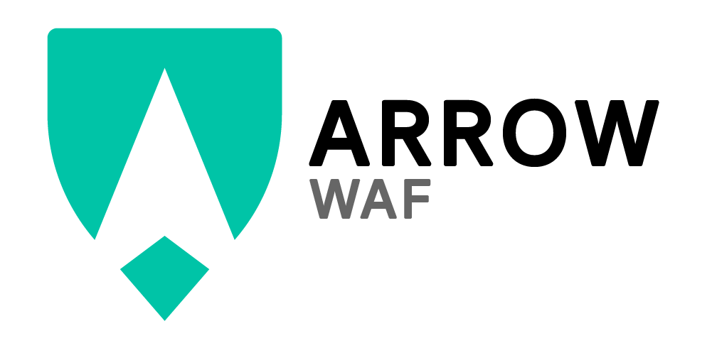

# Arrow WAF

Arrow WAF is a Coraza-based web application firewall that natively emits Prometheus metrics. This project was more or less created out of spite for the fact that no modern WAFs have good Prometheus integrations.

Arrow WAF is built on Coraza and Echo.


## Configuration

Configuring the WAF is as simple as modifying the appropriate profile file in `profiles/` or setting environment variables.

You can change which profile the application loads by setting `APP_PROFILE` to the name of the desired profile. Default is `local`.

Configuration options can be set either by profile or environment variable, prefixed with `APP_`. For example, to set the log level to `debug`, you can either set it in the config, or use the variable `APP_LOG_LEVEL=debug`. To enable CPU profiling, set `APP_TESETING_PROFILE_CPU=true`, etc.

By default, the app listens on two ports:
- 6080 -- public WAF port
- 6081 -- system internal.

## Metrics
Prometheus metrics are served from `:6081/system/metrics` and expose the following custom metrics:

* `waf_operations_count{action, phase}` -- counter
* `waf_processing_latency_ms` -- histogram
* `waf_rule_match_count{rule_id}` -- counter


More metrics will be exported soon.


## Deploying

When deploying, be sure to set your upstream target for the WAF to forward traffic to by setting `APP_UPSTREAM_HOST`, `APP_UPSTREAM_PORT` and optionally `APP_UPSTREAM_PROTOCOL` (default: `http`).

``` 
$> docker run -d -e APP_UPSTREAM_HOST=10.0.0.10 -e APP_UPSTREAM_PORT=80 -p 6080:6080 -p 6081:6081 ghcr.io/divertly/waf:latest
```


## Contributing
Contributions are welcome! Use the typical fork+PR workflow to submit your changes.